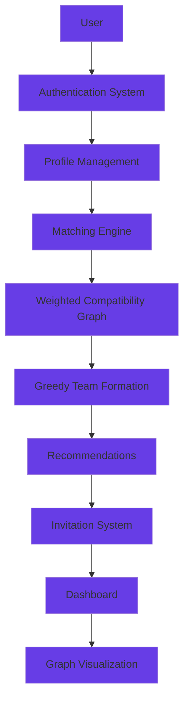

# TeamForge
A graph-based intelligent team formation platform that recommends compatible teammates using weighted compatibility scoring and greedy optimization.

## Intelligent Team Formation Platform

A sophisticated web application that intelligently forms balanced student teams using graph-based compatibility scoring and greedy optimization algorithms. TeamForge replaces inefficient manual team formation with data-driven matching based on skills, interests, academic diversity, and collaborative potential.

---

## 📋 Overview

### The Problem

Traditional team formation in academic settings relies on:
- Manual grouping by instructors or self-selection
- Random assignment without considering compatibility
- Lack of diversity in skills and perspectives
- Inefficient collaboration due to mismatched team dynamics
- Time-consuming process for large cohorts

### The Solution

TeamForge automates team formation using:
- **Weighted Compatibility Scoring**: Multi-factor analysis of student profiles
- **Greedy Team Formation Algorithm**: Optimized team composition
- **Graph-Based Visualization**: Interactive network analysis
- **Intelligent Recommendations**: Data-driven partner suggestions
- **Invitation System**: Collaborative team building workflow

TeamForge aims to improve team quality by considering multiple compatibility factors instead of relying on random or manual grouping.

---

## ✨ Features

### Core Functionality

- **User Registration with OTP Verification**: Secure email-based authentication
- **Complete Profile Management**: Skills, interests, branch, year, gender, contact
- **Intelligent Matching Engine**: Multi-factor compatibility scoring
- **Greedy Team Formation**: Optimized team composition algorithm
- **Partner Recommendations**: Top-N compatible partners for each student
- **Interactive Network Graph**: D3.js-powered visualization of student connections
- **Team Invitation System**: Send, accept, or decline collaboration requests
- **Responsive Dashboard**: Central hub for all team formation activities
- **Student Profile Viewing**: Detailed profile inspection for informed decisions

### Technical Features

- **Weighted Compatibility Graph**: Edge weights represent compatibility scores
- **Branch Diversity Bonus**: Encourages cross-disciplinary collaboration
- **Year Proximity Scoring**: Favors similar academic years for better alignment
- **Real-time Team Updates**: Dynamic team formation and recommendations
- **SQLite Database**: Lightweight, zero-configuration data storage
- **Django Authentication**: Secure user management and session handling

---

## 🛠 Tech Stack

### Backend

- **Django 5.2**: Python web framework
- **Python 3.8+**: Core programming language
- **SQLite**: Embedded database engine

### Frontend

- **HTML5**: Semantic markup
- **CSS3**: Custom styling with responsive design
- **Bootstrap 5.3**: UI framework for responsive components
- **JavaScript**: Client-side interactivity
- **D3.js v7**: Data visualization for network graphs

### Algorithms

- **Weighted Compatibility Graph**: Multi-factor scoring system
- **Greedy Team Formation**: Optimization algorithm for team composition
- **Combinatorial Analysis**: Pairwise compatibility computation

---

## 🏗 Project Architecture



---

## ⚙ Matching Engine Architecture

### Step 1: Profile Collection

The system fetches all student profiles from the database, extracting:
- User identification (ID, username, email)
- Skills (comma-separated list)
- Interests (comma-separated list)
- Academic information (branch, year)
- Demographics (gender, contact number)

### Step 2: Weighted Compatibility Score

For each student pair, compute compatibility using:

```
Score = (2.0 × Common Skills) 
      + (1.5 × Common Interests) 
      + (1.0 × Branch Diversity Bonus) 
      + (0.5 × Year Proximity Bonus)
```

**Weight Rationale:**
- **Skills (2.0)**: Technical compatibility is most critical for project success
- **Interests (1.5)**: Shared interests improve motivation and collaboration
- **Branch Diversity (1.0)**: Cross-disciplinary teams bring diverse perspectives
- **Year Proximity (0.5)**: Similar academic years ensure comparable experience levels

### Step 3: Weighted Graph Construction

Build an undirected weighted graph where:
- **Nodes**: Individual students
- **Edges**: Compatibility relationships
- **Weights**: Compatibility scores (threshold-filtered)

Edges are sorted by weight in descending order for optimal processing.

### Step 4: Greedy Team Formation

Algorithm:
1. Initialize empty team set and unassigned student pool
2. While unassigned students exist:
   - Select first unassigned student as team seed
   - Initialize new team with seed student
   - While team size < MAX_TEAM_SIZE (4):
     - Find unassigned student with highest average compatibility to team
     - Add student to team if beneficial
     - Mark student as assigned
   - Store completed team
3. Return all formed teams

### Step 5: Recommendations

For each student, generate top-N compatible partners:
- Compute compatibility scores with all other students
- Sort by score in descending order
- Return top 5 recommendations
- Include invitation status for each recommendation

---

## 📐 Compatibility Formula

### Mathematical Definition

For two students S₁ and S₂:

```
Compatibility(S₁, S₂) = 
    2.0 × |Skills(S₁) ∩ Skills(S₂)|
    + 1.5 × |Interests(S₁) ∩ Interests(S₂)|
    + 1.0 × I[Branch(S₁) ≠ Branch(S₂)]
    + 0.5 × YearProximity(S₁, S₂)
```

Where:
- `|A ∩ B|`: Cardinality of intersection
- `I[condition]`: Indicator function (1 if true, 0 if false)
- `YearProximity(S₁, S₂)`: 
  - 1.0 if |Year(S₁) - Year(S₂)| = 0
  - 0.5 if |Year(S₁) - Year(S₂)| = 1
  - 0.0 otherwise

### Example Calculation

**Student A**: Skills=[Python, Django], Interests=[AI, ML], Branch=CSE, Year=3
**Student B**: Skills=[Python, React], Interests=[AI, Web], Branch=ECE, Year=3

```
Common Skills = 1 (Python)
Common Interests = 1 (AI)
Branch Diversity = 1 (CSE ≠ ECE)
Year Proximity = 1.0 (same year)

Score = 2.0×1 + 1.5×1 + 1.0×1 + 0.5×1.0 = 5.0
```

---

## 🔄 Team Formation Algorithm

### Complete Greedy Algorithm

```
INPUT: List of students S, maximum team size K
OUTPUT: Dictionary of teams {team_id: [students]}

1. Initialize:
   - student_map = {s.id: s for s in S}
   - assigned = empty set
   - teams = empty dictionary
   - team_counter = 1

2. For each student in S:
   a. If student.id in assigned: continue
   b. Create new_team = [student.id]
   c. Add student.id to assigned
   d. While len(new_team) < K:
      i.   best_student = None
      ii.  best_score = -1
      iii. For each candidate in S:
           - If candidate.id in assigned: continue
           - Calculate avg_compatibility:
               sum = 0
               For each member in new_team:
                   sum += compatibility_score(
                       student_map[member], 
                       candidate
                   )
               avg = sum / len(new_team)
           - If avg > best_score:
               best_score = avg
               best_student = candidate.id
      iv.  If best_student is None: break
      v.   Add best_student to assigned
      vi.  Add best_student to new_team
   e. teams[team_counter] = [student_map[id] for id in new_team]
   f. team_counter += 1

3. Return teams
```

### Complexity Analysis

- **Time Complexity**: O(n² × k) where n = number of students, k = max team size
  - Pairwise compatibility: O(n²)
  - Team formation: O(n × k × n) = O(n²k)
- **Space Complexity**: O(n²) for storing the compatibility graph
- **Optimization**: Early termination when no beneficial candidates exist

---

## 🆚 Greedy vs DSU Algorithm

| Aspect | Old DSU Approach | Current Greedy Algorithm |
|--------|------------------|-------------------------|
| **Optimization Goal** | Connected components | Maximum team compatibility |
| **Team Quality** | Random within components | Optimized by compatibility scores |
| **Flexibility** | Fixed threshold-based | Dynamic team size adjustment |
| **Edge Weights** | Ignored | Fully utilized |
| **Diversity Support** | Limited | Explicit branch diversity bonus |
| **Recommendation Quality** | Basic connectivity | Top-N ranked by score |
| **Team Size Control** | Uncontrolled | Strict MAX_TEAM_SIZE limit |
| **Scalability** | O(n) union operations | O(n²k) but produces better teams |

### Why Greedy was chosen

The greedy algorithm is specifically designed for team formation because:
1. **Quality Over Speed**: Prioritizes team quality over computational efficiency
2. **Weight Utilization**: Leverages compatibility scores for optimal matching
3. **Diversity Encouragement**: Explicitly rewards cross-disciplinary collaboration
4. **Team Size Control**: Ensures balanced team sizes for fair workload distribution
5. **Recommendation Alignment**: Team formation and recommendations use the same scoring metric

---

## 📁 Folder Structure

```
TeamForge/
│
├── accounts/                    # User authentication and profiles
│   ├── migrations/              # Database migrations
│   ├── templates/               # Account-related HTML templates
│   │   ├── dashboard.html
│   │   ├── edit_profile.html
│   │   ├── home.html
│   │   ├── login.html
│   │   ├── navbar.html
│   │   ├── profile.html
│   │   ├── register.html
│   │   └── verify_otp.html
│   ├── __init__.py
│   ├── admin.py
│   ├── models.py               # Profile and Invitation models
│   ├── tests.py
│   └── views.py                # Authentication and profile views
│
├── matching/                    # Core matching engine
│   ├── migrations/              # Database migrations
│   ├── templates/              # Matching-related HTML templates
│   │   └── matching/
│   │       ├── clusters.html   # Team formation display
│   │       ├── graph.html      # Network visualization
│   │       ├── home.html
│   │       ├── invitations.html
│   │       ├── recommendations.html
│   │       └── student_profile.html
│   ├── __init__.py
│   ├── admin.py
│   ├── logic.py                # Matching algorithms
│   ├── tests.py
│   └── views.py                # Matching views
│
├── static/                      # Static assets
│   ├── css/
│   ├── image/                   # Background images
│   └── styles.css
│
├── TeamForge/                   # Django project configuration
│   ├── __init__.py
│   ├── asgi.py
│   ├── settings.py
│   ├── urls.py
│   └── wsgi.py
│
├── db.sqlite3                   # SQLite database
├── manage.py                    # Django management script
├── requirements.txt             # Python dependencies
├── .gitignore                   # Git ignore rules
├── LICENSE                      # MIT License
└── README.md                    # This file
```

---

## 🎯 Key Engineering Highlights

- Designed a weighted graph-based compatibility engine for intelligent student matching.
- Implemented a Greedy Optimization algorithm to form balanced project teams.
- Built secure email OTP authentication and profile management using Django.
- Developed a team invitation workflow for collaboration.
- Visualized compatibility relationships using interactive D3.js network graphs.
- Structured the application following Django's MVT architecture.


## 🚀 Installation

### Prerequisites

- Python 3.8 or higher
- pip (Python package manager)
- Git (for cloning)

### Step 1: Clone the Repository

```bash
git clone https://github.com/priya-nka-meena/teamforge.git
cd TeamForge
```

### Step 2: Create Virtual Environment

```bash
# Windows
python -m venv venv
venv\Scripts\activate

# macOS/Linux
python3 -m venv venv
source venv/bin/activate
```

### Step 3: Install Dependencies

```bash
pip install -r requirements.txt
```

### Step 4: Configure Email Settings (Optional)

Edit `TeamForge/settings.py` to configure OTP email:

```python
EMAIL_BACKEND = 'django.core.mail.backends.smtp.EmailBackend'
EMAIL_HOST = 'smtp.gmail.com'
EMAIL_PORT = 587
EMAIL_USE_TLS = True
EMAIL_HOST_USER = 'your-email@gmail.com'
EMAIL_HOST_PASSWORD = 'your-app-password'
```

### Step 5: Run Migrations

```bash
python manage.py makemigrations
python manage.py migrate
```

### Step 6: Create Superuser (Optional)

```bash
python manage.py createsuperuser
```

### Step 7: Run Development Server

```bash
python manage.py runserver
```

### Step 8: Access the Application

Open your browser and navigate to:
```
http://127.0.0.1:8000
```

---

## 🔮 Future Enhancements

- **AI-Based Compatibility Prediction**: Explore machine learning models to improve team recommendations using historical collaboration data.

- **Personality-Based Matching**: Incorporate personality assessments (e.g., MBTI or Big Five) as an additional compatibility factor.

- **Real-Time Team Chat**: Enable in-app messaging for seamless communication after team formation.

- **Faculty Dashboard**: Allow instructors to create projects, monitor teams, and review team composition.

- **Production Deployment**: Deploy the application using Docker and PostgreSQL for scalability and production readiness.

- **REST API Support**: Expose APIs to integrate TeamForge with other university platforms and mobile applications.

---

## 👩‍💻 Author

**Priyanka Meena**
- B.Tech, National Institute of Technology Delhi
- GitHub: https://github.com/priya-nka-meena
